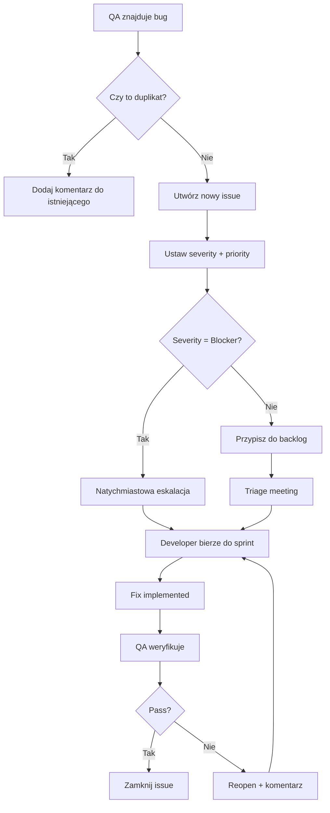

# Plan Testów dla Projektu 10xCards

## 1. Wprowadzenie i Cele Testowania

### 1.1 Cel dokumentu
Niniejszy plan testów definiuje strategię, zakres i podejście do testowania aplikacji 10xCards - platformy do nauki języków z wykorzystaniem fiszek i algorytmu Leitnera z integracją AI.

### 1.2 Cele testowania
- **Zapewnienie jakości**: Weryfikacja poprawności funkcjonalności zgodnie z wymaganiami biznesowymi
- **Bezpieczeństwo**: Potwierdzenie skuteczności mechanizmów autentykacji i autoryzacji (RLS)
- **Wydajność**: Sprawdzenie responsywności aplikacji przy różnych obciążeniach
- **Niezawodność**: Weryfikacja stabilności działania algorytmu Leitnera i integracji z AI
- **Użyteczność**: Ocena dostępności (a11y) i responsywności interfejsu

### 1.3 Zakres projektu
Aplikacja webowa do nauki języków z:
- Frontend: Astro 5 + React 19 + TypeScript 5 + Tailwind 4 + Shadcn/ui
- Backend: Supabase (PostgreSQL, Auth, BaaS)
- AI: Integracja przez OpenRouter.ai (Meta Llama 3.2)
- Algorytm: System powtórek rozłożonych w czasie (Leitner)

## 2. Zakres Testów

### 2.1 Komponenty w zakresie testów

#### 2.1.1 Moduł Autentykacji
- Rejestracja użytkowników (`/rejestracja`)
- Logowanie (`/logowanie`)
- Potwierdzenie email (`/potwierdzenie-email`)
- Wylogowanie
- Middleware autentykacji

#### 2.1.2 Moduł Zarządzania Fiszkami
- Tworzenie fiszek (ręczne i AI)
- Edycja inline w tabeli (`EditableCell`)
- Usuwanie z potwierdzeniem (`DeleteButton`)
- Listowanie z paginacją (`FlashcardTable`)
- Sortowanie i filtrowanie

#### 2.1.3 Moduł Generowania AI
- Formularz generowania (`AiTab`)
- Walidacja tekstu wejściowego
- Komunikacja z OpenRouter API
- Parsowanie odpowiedzi JSON
- Edycja sugestii (`SuggestionItem`)
- Import fiszek do bazy
- Logowanie metryk (`ai_generation_logs`)

#### 2.1.4 Moduł Nauki (Review Session)
- Pobieranie fiszek do powtórki
- Wyświetlanie karty (`FlashcardDisplay`)
- Akcje "Wiem"/"Nie wiem" (`ReviewActions`)
- Aktualizacja algorytmu Leitnera
- Podsumowanie sesji (`SessionSummary`)

#### 2.1.5 Moduł Ustawień
- Formularz ustawień (`SettingsForm`)
- Zmiana domyślnego poziomu AI (A1-C2)
- Optymistyczne aktualizacje UI
- Powiadomienia toast

#### 2.1.6 Warstwa Danych
- Serwisy biznesowe (`flashcard.service`, `review.service`, `profile.service`)
- Funkcje PostgreSQL (`update_flashcard_review`, `import_ai_flashcards`)
- Polityki RLS na wszystkich tabelach
- Triggery (`handle_new_user`)
- Indeksy wydajnościowe

### 2.2 Komponenty poza zakresem testów
- Infrastruktura Docker/DigitalOcean (testy deployment poza zakresem)
- Konfiguracja GitHub Actions (zakładamy prawidłowe działanie CI/CD)
- Komponenty UI Shadcn/ui (zakładamy bibliotekę jako sprawdzoną)

## 3. Typy Testów

### 3.1 Testy Jednostkowe (Unit Tests)
**Priorytet: WYSOKI**

#### 3.1.1 Serwisy biznesowe
**Narzędzie**: Vitest + @supabase/supabase-js mock

**Zakres**:
- flashcard.service.ts
  - `getFlashcards()` - paginacja, sortowanie, filtrowanie
  - `createFlashcard()` - walidacja danych, obsługa błędów
  - `updateFlashcard()` - częściowe aktualizacje, RLS
  - `importAiFlashcards()` - transakcja RPC, rollback
  
- review.service.ts
  - `getReviewSessionCards()` - filtrowanie po `review_due_at`
  - `updateCardReviewStatus()` - logika Leitnera
  
- `profile.service.ts`
  - `getProfile()` - obsługa brakującego profilu
  - `updateProfile()` - walidacja `language_level`

**Przykładowy test**:
```typescript
describe('flashcardService.createFlashcard', () => {
  it('should create flashcard with valid data', async () => {
    const mockSupabase = createMockSupabaseClient();
    const result = await flashcardService.createFlashcard(
      mockSupabase, 
      'user-123', 
      { front: 'hello', back: 'cześć', part_of_speech: 'noun' }
    );
    expect(result.front).toBe('hello');
    expect(result.leitner_box).toBe(1);
  });
  
  it('should throw error when front exceeds 249 chars', async () => {
    const longText = 'a'.repeat(250);
    await expect(
      flashcardService.createFlashcard(mockSupabase, 'user-123', { front: longText, back: 'test' })
    ).rejects.toThrow('Database operation failed');
  });
});
```

#### 3.1.2 Hooki React
**Narzędzie**: Vitest + @testing-library/react-hooks

**Zakres**:
- `useFlashcards` - zarządzanie stanem listy
- `useAiGeneration` - lifecycle generowania
- `useManualFlashcard` - walidacja formularza
- `useReviewSession` - stan sesji nauki

#### 3.1.3 Walidatory Zod
**Zakres**:
- `CreateFlashcardSchema` - limity długości, required fields
- `UpdateFlashcardSchema` - optional fields, nullable
- `importFlashcardsRequestSchema` - zgodność count
- `updateProfileSchema` - enum validation

### 3.2 Testy Integracyjne (Integration Tests)
**Priorytet: WYSOKI**

#### 3.2.1 Endpointy API
**Narzędzie**: Vitest + Supabase Local (Docker)

**Scenariusze**:

**GET /api/flashcards**
```gherkin
Scenario: Pobieranie listy fiszek z paginacją
  Given użytkownik jest zalogowany
  And ma 50 fiszek w bazie
  When wysyła GET /api/flashcards?page=2&pageSize=20
  Then otrzymuje status 200
  And otrzymuje 20 fiszek
  And pagination.currentPage = 2
  And pagination.totalPages = 3
```

**POST /api/flashcards**
```gherkin
Scenario: Tworzenie fiszki przez niezalogowanego użytkownika
  Given użytkownik nie jest zalogowany
  When wysyła POST /api/flashcards
  Then otrzymuje status 401
  And otrzymuje message "Unauthorized"
```

**POST /api/ai/import-flashcards**
```gherkin
Scenario: Import 5 fiszek z AI z metrykami
  Given użytkownik ma profil z default_ai_level = 'b2'
  And ma 5 zatwierdzonych sugestii AI
  When wywołuje RPC import_ai_flashcards
  Then tworzy 5 nowych fiszek z ai_generated = true
  And tworzy 1 rekord w ai_generation_logs
  And generatedCount = 7, importedCount = 5
```

**PATCH /api/flashcards/[id]**
```gherkin
Scenario: Próba edycji cudzej fiszki (RLS)
  Given user_A ma fiszkę z id = 'abc-123'
  And user_B jest zalogowany
  When user_B wysyła PATCH /api/flashcards/abc-123
  Then otrzymuje status 404
  And fiszka user_A pozostaje niezmieniona
```

#### 3.2.2 Funkcje PostgreSQL
**Narzędzie**: pgTAP (opcjonalnie) lub Vitest z lokalnym Supabase

**Scenariusze**:

**update_flashcard_review()**
```sql
-- Test: "Wiem" przesuwa z box 1 do box 2 i ustawia due_at na +1 dzień
INSERT INTO flashcards (id, user_id, leitner_box, review_due_at)
VALUES ('test-id', auth.uid(), 1, NOW());

SELECT update_flashcard_review('test-id', true);

SELECT leitner_box = 2 
AND review_due_at BETWEEN (NOW() + INTERVAL '23 hours') AND (NOW() + INTERVAL '25 hours')
FROM flashcards WHERE id = 'test-id';
```

**import_ai_flashcards() RPC**
```sql
-- Test: Transakcja atomowa - rollback przy błędzie
BEGIN;
  SELECT import_ai_flashcards(
    flashcards_data := '[{"front":"test","back":"test"}]',
    language_level_input := 'invalid_level', -- spowoduje błąd
    metrics_data := '{"generatedCount":1,"importedCount":1}',
    user_id_input := auth.uid()
  );
EXCEPTION WHEN OTHERS THEN
  -- Weryfikuj, że nic nie zostało zapisane
  SELECT COUNT(*) = 0 FROM flashcards WHERE user_id = auth.uid();
  SELECT COUNT(*) = 0 FROM ai_generation_logs WHERE user_id = auth.uid();
END;
```

#### 3.2.3 Middleware i Auth Flow
**Scenariusze**:
- Przekierowanie niezalogowanego z `/moje-fiszki` do `/logowanie`
- Odświeżanie tokenu przy wygaśnięciu sesji
- Obsługa błędów Supabase Auth (invalid credentials, expired token)

### 3.3 Testy End-to-End (E2E)
**Priorytet: ŚREDNI**
**Narzędzie**: Playwright

#### 3.3.1 Krytyczne ścieżki użytkownika

**User Journey 1: Rejestracja i pierwsza fiszka**
```typescript
test('Nowy użytkownik rejestruje się i tworzy fiszkę', async ({ page }) => {
  // 1. Rejestracja
  await page.goto('/rejestracja');
  await page.fill('input[type="email"]', 'test@example.com');
  await page.fill('input[type="password"]', 'SecurePass123!');
  await page.click('button[type="submit"]');
  
  // 2. Potwierdzenie email (mock Mailpit)
  await page.goto('http://localhost:54324'); // Mailpit
  await page.click('text=Potwierdź adres email');
  
  // 3. Logowanie
  await page.goto('/logowanie');
  await page.fill('input[type="email"]', 'test@example.com');
  await page.fill('input[type="password"]', 'SecurePass123!');
  await page.click('button[type="submit"]');
  
  // 4. Przekierowanie do strony głównej
  await expect(page).toHaveURL('/');
  
  // 5. Tworzenie fiszki ręcznie
  await page.click('text=Ręcznie');
  await page.fill('#front', 'hello');
  await page.fill('#back', 'cześć (powitanie)');
  await page.selectOption('#part_of_speech', 'noun');
  await page.click('button:has-text("Dodaj fiszkę")');
  
  // 6. Weryfikacja toasta
  await expect(page.locator('text=Fiszka została dodana')).toBeVisible();
  
  // 7. Sprawdzenie listy fiszek
  await page.goto('/moje-fiszki');
  await expect(page.locator('text=hello')).toBeVisible();
});
```

**User Journey 2: Generowanie AI i sesja nauki**
```typescript
test('Użytkownik generuje fiszki AI i uczy się', async ({ page }) => {
  // Zakładając zalogowanego użytkownika
  await page.goto('/');
  await page.click('text=AI');
  
  // 1. Wprowadzenie tekstu
  const sampleText = 'The quick brown fox jumps over the lazy dog.';
  await page.fill('textarea', sampleText);
  await page.selectOption('select[name="level"]', 'b2');
  await page.click('button:has-text("Generuj fiszki")');
  
  // 2. Oczekiwanie na sugestie
  await expect(page.locator('.suggestion-item')).toHaveCount.greaterThan(0);
  
  // 3. Edycja jednej sugestii
  await page.locator('.suggestion-item').first().click();
  await page.fill('input[id^="front-"]', 'quick');
  await page.press('input[id^="front-"]', 'Enter');
  
  // 4. Import fiszek
  await page.click('button:has-text("Importuj fiszki")');
  await expect(page.locator('text=Fiszki zostały zaimportowane')).toBeVisible();
  
  // 5. Rozpoczęcie sesji nauki
  await page.goto('/ucz-sie');
  await expect(page.locator('.flashcard-front')).toBeVisible();
  
  // 6. Odpowiedź "Wiem"
  await page.click('button:has-text("Wiem")');
  
  // 7. Sprawdzenie kolejnej karty lub podsumowania
  await expect(
    page.locator('.flashcard-front, .session-summary')
  ).toBeVisible();
});
```

**User Journey 3: Edycja inline i usuwanie**
```typescript
test('Użytkownik edytuje i usuwa fiszkę', async ({ page }) => {
  await page.goto('/moje-fiszki');
  
  // 1. Kliknięcie w komórkę "front"
  const firstRow = page.locator('tbody tr').first();
  await firstRow.locator('button[aria-label*="front"]').click();
  
  // 2. Edycja
  await page.fill('input[value="hello"]', 'hi');
  await page.press('input', 'Enter');
  
  // 3. Weryfikacja toasta
  await expect(page.locator('text=Zapisano zmiany')).toBeVisible();
  
  // 4. Usuwanie
  await firstRow.locator('button[aria-label="Usuń"]').click();
  await page.locator('button:has-text("Usuń")').click(); // Dialog
  
  // 5. Weryfikacja
  await expect(page.locator('text=Fiszka została usunięta')).toBeVisible();
  await expect(page.locator('text=hi')).not.toBeVisible();
});
```

### 3.4 Testy Wydajnościowe
**Priorytet: ŚREDNI**
**Narzędzie**: k6 / Artillery

#### 3.4.1 Scenariusze obciążeniowe

**Load Test: Pobieranie listy fiszek**
```javascript
export default function () {
  const token = getAuthToken(); // helper
  http.get('http://localhost:4321/api/flashcards?page=1&pageSize=20', {
    headers: { 'Authorization': `Bearer ${token}` }
  });
}

export const options = {
  stages: [
    { duration: '1m', target: 50 },  // ramp-up
    { duration: '3m', target: 50 },  // steady
    { duration: '1m', target: 0 },   // ramp-down
  ],
  thresholds: {
    http_req_duration: ['p(95)<500'], // 95% requestów < 500ms
    http_req_failed: ['rate<0.01'],   // < 1% błędów
  },
};
```

**Stress Test: Import AI (RPC)**
```javascript
export default function () {
  const payload = {
    flashcards: Array(20).fill({ front: 'test', back: 'test' }),
    metrics: { generatedCount: 25, importedCount: 20 }
  };
  
  http.post('http://localhost:4321/api/ai/import-flashcards', 
    JSON.stringify(payload), 
    { headers: { 'Content-Type': 'application/json' } }
  );
}

export const options = {
  stages: [
    { duration: '2m', target: 100 },  // stress
    { duration: '5m', target: 100 },
    { duration: '2m', target: 200 },  // breaking point
  ],
};
```

**Spike Test: Concurrent review sessions**
- Symulacja 500 użytkowników jednocześnie rozpoczynających sesję nauki
- Weryfikacja działania indeksów `flashcards_review_session_idx`

### 3.5 Testy Bezpieczeństwa
**Priorytet: KRYTYCZNY**

#### 3.5.1 Row Level Security (RLS)
**Metoda**: Testy manualne + pgTAP

**Scenariusze**:
1. **Izolacja danych między użytkownikami**
   ```sql
   -- User A tworzy fiszkę
   SET LOCAL jwt.claims.sub TO 'user-a-uuid';
   INSERT INTO flashcards (user_id, front, back) 
   VALUES ('user-a-uuid', 'test', 'test');
   
   -- User B próbuje pobrać
   SET LOCAL jwt.claims.sub TO 'user-b-uuid';
   SELECT COUNT(*) = 0 FROM flashcards WHERE front = 'test'; -- PASS
   ```

2. **Ochrona przed SQL Injection**
   - Testy parametryzowanych zapytań w serwisach
   - Fuzzing inputów (special chars, SQL keywords)

3. **IDOR Prevention**
   ```http
   PATCH /api/flashcards/other-user-flashcard-id
   Authorization: Bearer <user-token>
   
   Expected: 404 Not Found (nie 403, aby nie ujawniać istnienia)
   ```

#### 3.5.2 Autentykacja i Autoryzacja
- **Brak tokenu**: 401 dla chronionych endpointów
- **Wygasły token**: Automatyczne odświeżanie lub logout
- **Manipulacja tokenu**: Weryfikacja podpisu JWT przez Supabase

#### 3.5.3 Input Validation
- **XSS**: Testowanie HTML/JS w polach tekstowych
- **Oversized payload**: Requesty > 2MB dla AI generation
- **Invalid enum**: Próba ustawienia `language_level = 'z9'`

### 3.6 Testy Dostępności (a11y)
**Priorytet: ŚREDNI**
**Narzędzie**: axe-core + Lighthouse CI

**Zakres**:
- **ARIA labels**: Wszystkie interaktywne elementy (`EditableCell`, `DeleteButton`)
- **Keyboard navigation**: Tab order, Enter/Escape handling
- **Screen reader**: Announcements dla toastów, loading states
- **Color contrast**: WCAG AA compliance (Tailwind default palette)
- **Focus management**: Visible focus rings, trap w dialog

**Automated checks**:
```javascript
import { test } from '@playwright/test';
import AxeBuilder from '@axe-core/playwright';

test('Strona główna spełnia WCAG 2.1 AA', async ({ page }) => {
  await page.goto('/');
  const results = await new AxeBuilder({ page }).analyze();
  expect(results.violations).toEqual([]);
});
```

### 3.7 Testy Regresji
**Priorytet: WYSOKI**
**Trigger**: Przed każdym merge do `main`

**Zakres**:
- Re-run wszystkich testów jednostkowych
- Re-run smoke testów E2E (happy paths)
- Weryfikacja migracji bazy na czystym środowisku

### 3.8 Testy Eksploracyjne
**Priorytet: NISKI**
**Częstotliwość**: Raz na sprint

**Obszary**:
- Edge cases w algorytmie Leitnera (box > 10, due_at w przeszłości)
- Interakcje z AI przy nietypowych inputach (emoji, języki RTL)
- Responsywność na różnych urządzeniach (mobile, tablet)

## 4. Scenariusze Testowe dla Kluczowych Funkcjonalności

### 4.1 Moduł Algorytmu Leitnera

#### TC-LEITNER-001: Przejście z box 1 do box 2 ("Wiem")
**Priorytet**: Krytyczny  
**Warunki wstępne**: Fiszka w box 1, `review_due_at <= NOW()`  
**Kroki**:
1. Wywołaj `update_flashcard_review(flashcard_id, true)`
2. Pobierz zaktualizowaną fiszkę

**Oczekiwany rezultat**:
- `leitner_box = 2`
- `review_due_at = NOW() + 1 day` (±1h tolerancja)

**Dane testowe**:
```json
{
  "flashcard_id": "abc-123",
  "initial_box": 1,
  "knew_it": true
}
```

#### TC-LEITNER-002: Reset do box 1 ("Nie wiem")
**Priorytet**: Krytyczny  
**Warunki wstępne**: Fiszka w box 4  
**Kroki**:
1. Wywołaj `update_flashcard_review(flashcard_id, false)`

**Oczekiwany rezultat**:
- `leitner_box = 1`
- `review_due_at = NOW()` (natychmiastowa powtórka)

#### TC-LEITNER-003: Progresja do box 5+ (długoterminowa pamięć)
**Warunki wstępne**: Fiszka w box 5  
**Kroki**:
1. Wywołaj `update_flashcard_review(flashcard_id, true)`

**Oczekiwany rezultat**:
- `leitner_box = 6`
- `review_due_at = NOW() + 30 days`

### 4.2 Moduł AI Generation

#### TC-AI-001: Generowanie sugestii dla poziomu B2
**Priorytet**: Wysoki  
**Warunki wstępne**: Użytkownik zalogowany, profil z `default_ai_level = 'b2'`  
**Kroki**:
1. Wyślij POST `/api/ai/generate-suggestions`
   ```json
   {
     "text": "The industrial revolution transformed society.",
     "level": "b2"
   }
   ```
2. Poczekaj na odpowiedź (timeout 30s)

**Oczekiwany rezultat**:
- Status 200
- JSON z tablicą `suggestions`
- Każda sugestia ma `front`, `back` (w formacie "tłumaczenie (definicja)"), `part_of_speech`, `id`
- Minimum 3 sugestie

**Kryteria akceptacji**:
- `back` zawsze po polsku
- `back` zawiera nawiasy z definicją
- `part_of_speech` z dozwolonych wartości lub null

#### TC-AI-002: Walidacja tekstu zbyt długiego
**Warunki wstępne**: Tekst > 2000 znaków  
**Oczekiwany rezultat**:
- Status 422
- Błąd: "Tekst nie może przekraczać 2000 znaków"

#### TC-AI-003: Timeout API OpenRouter
**Symulacja**: Mock opóźnionej odpowiedzi (> 30s)  
**Oczekiwany rezultat**:
- Status 502
- Błąd: "Wystąpił błąd podczas generowania fiszek"
- Brak zapisanych danych w bazie

#### TC-AI-004: Import sugestii z metrykami
**Warunki wstępne**: 5 sugestii w stanie przygotowanym  
**Kroki**:
1. Edytuj 2 sugestie (zmiana `back`)
2. Usuń 1 sugestię
3. Kliknij "Importuj" (4 pozostałe)

**Oczekiwany rezultat**:
- POST `/api/ai/import-flashcards` z:
  ```json
  {
    "flashcards": [4 obiekty z edytowanymi wartościami],
    "metrics": { "generatedCount": 5, "importedCount": 4 }
  }
  ```
- 4 nowe fiszki z `ai_generated = true`
- 1 rekord w `ai_generation_logs`

### 4.3 Moduł Edycji Inline

#### TC-EDIT-001: Edycja pola "front" z zapisem
**Warunki wstępne**: Lista fiszek załadowana  
**Kroki**:
1. Kliknij komórkę "front" pierwszej fiszki
2. Zmień tekst na "updated"
3. Naciśnij Enter

**Oczekiwany rezultat**:
- Input zmienia się z powrotem na button
- Toast: "Zapisano zmiany"
- PATCH `/api/flashcards/{id}` z `{"front": "updated"}`
- Odświeżenie tabeli pokazuje nową wartość

#### TC-EDIT-002: Anulowanie edycji przez Escape
**Kroki**:
1. Kliknij komórkę
2. Zmień tekst
3. Naciśnij Escape

**Oczekiwany rezultat**:
- Poprzednia wartość przywrócona
- Brak requestu do API
- Brak toasta

#### TC-EDIT-003: Walidacja pustego pola
**Kroki**:
1. Edytuj "front"
2. Usuń cały tekst
3. Kliknij poza input

**Oczekiwany rezultat**:
- Poprzednia wartość przywrócona
- Toast błędu: "Pole nie może być puste"

### 4.4 Moduł Review Session

#### TC-REVIEW-001: Rozpoczęcie sesji z 10 fiszkami
**Warunki wstępne**: 15 fiszek z `review_due_at <= NOW()`  
**Kroki**:
1. GET `/api/review/session?limit=10`

**Oczekiwany rezultat**:
- Status 200
- JSON z 10 kartami
- Karty posortowane: `leitner_box ASC`, `review_due_at ASC`

#### TC-REVIEW-002: Brak fiszek do powtórki
**Warunki wstępne**: Wszystkie fiszki mają `review_due_at > NOW()`  
**Oczekiwany rezultat**:
- Status 200
- `{ "cards": [] }`
- UI pokazuje `EmptyState` z komunikatem

#### TC-REVIEW-003: Ukończenie sesji 5/5 poprawnych
**Kroki**:
1. Rozpocznij sesję z 5 kartami
2. Dla każdej kliknij "Wiem"
3. Sprawdź podsumowanie

**Oczekiwany rezultat**:
- `SessionSummary` pokazuje: "5/5 poprawnych"
- Wszystkie 5 fiszek awansowało do wyższego box
- Przyciski: "Nowa sesja", "Wróć do listy"

## 5. Środowisko Testowe

### 5.1 Środowisko Lokalne (Development)
**Cel**: Testy deweloperskie, debugowanie

**Konfiguracja**:
- **Frontend**: `npm run dev` (Astro dev server, port 4321)
- **Backend**: `npx supabase start` (Docker Compose)
  - PostgreSQL: port 54322
  - Studio: http://localhost:54323
  - API: http://localhost:54321
  - Mailpit: http://localhost:54324
- **AI Mock**: Optional - mock OpenRouter API dla szybszych testów

**Dane testowe**:
- Seed z `supabase/seed.sql` (3 użytkowników, 50 fiszek każdy)

### 5.2 Środowisko CI/CD (GitHub Actions)
**Cel**: Automated testing przy każdym PR

**Pipeline**:
```yaml
name: Tests
on: [pull_request]
jobs:
  test:
    runs-on: ubuntu-latest
    services:
      postgres:
        image: supabase/postgres:15
    steps:
      - uses: actions/checkout@v3
      - uses: actions/setup-node@v3
      - run: npm ci
      - run: npx supabase start
      - run: npm run test:unit
      - run: npm run test:integration
      - run: npx playwright test --project=chromium
```

**Artefakty**:
- Coverage report (Vitest)
- Playwright traces dla failed testów
- Lighthouse scores

### 5.3 Środowisko Staging
**Cel**: Testy akceptacyjne przed production

**Konfiguracja**:
- Hostowane na DigitalOcean (App Platform)
- Supabase Project w planie Pro
- Domena: `staging.10xcards.pl`
- Dane: Anonimizowana kopia produkcji (GDPR compliance)

**Testy**:
- Smoke tests E2E
- Performance baseline (k6)
- Security scan (OWASP ZAP)

### 5.4 Środowisko Produkcyjne
**Monitoring**:
- Supabase Dashboard (metryki bazy)
- Sentry (error tracking)
- Vercel Analytics (web vitals)

**Testy**:
- Synthetic monitoring (Pingdom/UptimeRobot)
- Smoke test po każdym deploy

## 6. Narzędzia do Testowania

### 6.1 Test Framework
| Narzędzie | Wersja | Zastosowanie |
|-----------|--------|--------------|
| **Vitest** | ^2.0.0 | Testy jednostkowe i integracyjne (szybszy od Jest, native ESM) |
| **Playwright** | ^1.47.0 | Testy E2E (lepsze API niż Cypress, obsługa wielu przeglądarek) |
| **@testing-library/react** | ^16.0.0 | Testowanie komponentów React |
| **@supabase/supabase-js** | ^2.76.0 | Mock client dla testów jednostkowych |

### 6.2 Performance Testing
| Narzędzie | Zastosowanie |
|-----------|--------------|
| **k6** | Load/stress testing API |
| **Lighthouse CI** | Web vitals, accessibility |
| **Artillery** | Alternatywa dla k6, łatwiejsza konfiguracja |

### 6.3 Security Testing
| Narzędzie | Zastosowanie |
|-----------|--------------|
| **OWASP ZAP** | Vulnerability scanning |
| **npm audit** | Dependency security check |
| **Snyk** | Continuous monitoring (opcjonalnie) |

### 6.4 Accessibility Testing
| Narzędzie | Zastosowanie |
|-----------|--------------|
| **axe-core** | WCAG compliance (zintegrowany z Playwright) |
| **Pa11y** | Automated a11y testing CLI |
| **NVDA/JAWS** | Manual screen reader testing |

### 6.5 CI/CD Integration
| Narzędzie | Zastosowanie |
|-----------|--------------|
| **GitHub Actions** | Pipeline orchestration |
| **Codecov** | Coverage reporting |
| **Percy** | Visual regression testing (opcjonalnie) |

### 6.6 Monitoring & Observability
| Narzędzie | Zastosowanie |
|-----------|--------------|
| **Supabase Studio** | Database metrics, query logs |
| **Sentry** | Error tracking, performance monitoring |
| **Vercel Analytics** | Core Web Vitals, user flow |

## 7. Harmonogram Testów

### 7.1 Faza 1: Setup i Infrastruktura (Tydzień 1)
**Zadania**:
- [ ] Konfiguracja Vitest + test environment
- [ ] Setup Playwright z example tests
- [ ] Przygotowanie seed data dla testów
- [ ] Konfiguracja GitHub Actions pipeline
- [ ] Dokumentacja konwencji testowych (naming, structure)

**Deliverables**:
- `vitest.config.ts`, `playwright.config.ts`
- `tests/setup/` z helperami (mockSupabase, testUser)
- CI pipeline passing (nawet bez testów biznesowych)

### 7.2 Faza 2: Testy Jednostkowe (Tydzień 2-3)
**Zadania**:
- [ ] Testy serwisów (`flashcard.service`, `review.service`, `profile.service`)
- [ ] Testy hooków React (`useFlashcards`, `useAiGeneration`)
- [ ] Testy walidatorów Zod
- [ ] Coverage report > 80% dla `/lib`

**Metryki sukcesu**:
- Min. 90% coverage dla business logic
- Wszystkie happy paths pokryte
- Min. 2 edge cases na funkcję

### 7.3 Faza 3: Testy Integracyjne API (Tydzień 4)
**Zadania**:
- [ ] Testy wszystkich endpointów `/api/*`
- [ ] Testy RPC functions PostgreSQL
- [ ] Testy RLS policies (manual + pgTAP)
- [ ] Negative scenarios (401, 422, 500)

**Metryki sukcesu**:
- 100% pokrycie endpointów
- Weryfikacja wszystkich status codes
- RLS tested z min. 2 userami

### 7.4 Faza 4: Testy E2E (Tydzień 5)
**Zadania**:
- [ ] User journey: Rejestracja → Pierwsza fiszka
- [ ] User journey: AI generation → Import → Review
- [ ] User journey: Edycja inline → Usuwanie
- [ ] User journey: Ustawienia profilu

**Metryki sukcesu**:
- 4 główne flows pokryte
- Stabilność testów > 95% (flaky tests < 5%)
- Czas wykonania < 10 min

### 7.5 Faza 5: Testy Niefunkcjonalne (Tydzień 6)
**Zadania**:
- [ ] Performance testing (k6 scenarios)
- [ ] Accessibility audit (axe + manual)
- [ ] Security scan (OWASP ZAP)
- [ ] Load testing baseline

**Metryki sukcesu**:
- P95 response time < 500ms
- 0 critical a11y issues
- 0 high-severity vulnerabilities

### 7.6 Faza 6: Regresja i Dokumentacja (Tydzień 7)
**Zadania**:
- [ ] Full regression test suite
- [ ] Test report z metrics
- [ ] Dokumentacja testów dla zespołu
- [ ] Training session dla developerów

**Deliverables**:
- Test execution report (pass rate, coverage)
- Known issues log
- Best practices guide

## 8. Kryteria Akceptacji Testów

### 8.1 Kryteria Wejścia (Entry Criteria)
Przed rozpoczęciem testów muszą być spełnione:
- ✅ Kod zmergowany do branch `develop`
- ✅ Build CI przechodzi (lint, type-check)
- ✅ Migracje Supabase zastosowane na środowisku testowym
- ✅ Seed data załadowane
- ✅ Dokumentacja API aktualna (README endpoints)

### 8.2 Kryteria Wyjścia (Exit Criteria)
Testy uznaje się za zakończone, gdy:
- ✅ **Pass rate**: ≥ 95% wszystkich testów automated
- ✅ **Coverage**: ≥ 80% line coverage dla lib i api
- ✅ **Blocker bugs**: 0 (krytyczne błędy zablokowane lub fixed)
- ✅ **High bugs**: ≤ 2 (znane, zadokumentowane w backlog)
- ✅ **Performance**: P95 < 500ms dla GET endpoints
- ✅ **Accessibility**: 0 critical violations (axe-core)
- ✅ **Security**: 0 high-severity issues (OWASP ZAP)

### 8.3 Definicja Severity
| Severity | Kryteria | Przykład |
|----------|----------|----------|
| **Blocker** | Uniemożliwia użytkowanie głównej funkcji | Crash przy tworzeniu fiszki |
| **Critical** | Funkcja działa niepoprawnie, brak workaround | Algorytm Leitnera nie przesuwa fiszek |
| **High** | Funkcja działa częściowo, jest workaround | Edycja inline wymaga refresh |
| **Medium** | Minor function issue lub visual bug | Toast nie znika automatycznie |
| **Low** | Kosmetyczne, nie wpływa na UX | Alignment tekstu w footerze |

### 8.4 Metryki Sukcesu
**KPI dla projektu testowego**:
- **Test Automation Rate**: ≥ 70% testów automated (unit + integration + E2E)
- **Defect Detection Rate**: ≥ 80% bugów znalezionych przed produkcją
- **Test Execution Time**: ≤ 15 min full regression suite
- **Flaky Test Rate**: ≤ 5% (max 1 na 20 testów)
- **Bug Escape Rate**: ≤ 1 critical bug na release w produkcji

## 9. Role i Odpowiedzialności

### 9.1 Test Manager / QA Lead
**Odpowiedzialności**:
- Zarządzanie planem testów i harmonogramem
- Koordynacja zespołu QA
- Raportowanie statusu testów do Project Managera
- Review test cases przed execution
- Eskalacja zablokowanych bugów

**Wymagane kompetencje**:
- Doświadczenie z testowaniem aplikacji webowych (React, TypeScript)
- Znajomość PostgreSQL i koncepcji RLS
- Znajomość Playwright/Vitest

### 9.2 QA Engineer (Automation)
**Odpowiedzialności**:
- Pisanie i utrzymanie testów jednostkowych (Vitest)
- Implementacja testów E2E (Playwright)
- Konfiguracja CI/CD pipeline dla testów
- Code review testów innych QA
- Analiza coverage reports

**Wymagane kompetencje**:
- TypeScript (intermediate)
- Vitest / Jest
- Playwright
- Git / GitHub Actions
- Podstawy SQL

### 9.3 QA Engineer (Manual / Exploratory)
**Odpowiedzialności**:
- Testy eksploracyjne na staging
- Weryfikacja accessibility (manual screen reader testing)
- Testy regresji dla krytycznych bugfixów
- Dokumentacja test cases w Jira/Linear
- User acceptance testing (UAT) z Product Ownerem

**Wymagane kompetencje**:
- Znajomość WCAG 2.1 guidelines
- Doświadczenie z narzędziami a11y (NVDA, axe DevTools)
- SQL (basic) do weryfikacji danych
- Komunikacja z developerami (bug reporting)

### 9.4 Developer
**Odpowiedzialności**:
- Pisanie testów jednostkowych dla nowego kodu (TDD)
- Debugging failed tests w CI
- Fixing bugów znalezionych przez QA
- Review pull requestów z testami
- Utrzymanie test coverage na poziomie ≥ 80%

**Proces**:
1. Developer tworzy PR z kodem + testy
2. CI uruchamia automated tests
3. QA Engineer robi code review testów
4. Jeśli testy przechodzą → merge
5. Jeśli failed → developer fixuje

### 9.5 DevOps Engineer
**Odpowiedzialności**:
- Konfiguracja i utrzymanie CI/CD pipeline
- Setup środowisk testowych (staging)
- Monitoring wydajności testów (execution time)
- Integracja z narzędziami (Codecov, Sentry)
- Troubleshooting infrastruktury testowej

## 10. Procedury Raportowania Błędów

### 10.1 Workflow Zgłaszania Bugu



### 10.2 Szablon Issue (GitHub Issues)

```markdown
## 🐛 Bug Report

**Title**: [Component] Short description (e.g., "FlashcardTable - Pagination breaks on page 2")

**Environment**:
- Browser: Chrome 120.0.6099.109
- OS: Windows 11
- Version: commit `abc123f` (branch: develop)
- Supabase: Local / Staging / Production

**Severity**: [Blocker / Critical / High / Medium / Low]
**Priority**: [P0 / P1 / P2 / P3]

**Steps to Reproduce**:
1. Navigate to `/moje-fiszki`
2. Click "Next page" button
3. Observe console error

**Expected Behavior**:
Page 2 should load with next 20 flashcards.

**Actual Behavior**:
- Error in console: `TypeError: Cannot read property 'map' of undefined`
- UI shows empty state
- Network tab shows 200 response with valid JSON

**Screenshots**:


**Logs/Console Output**:
```
TypeError: Cannot read property 'map' of undefined
    at FlashcardTable.tsx:42
```

**Additional Context**:
- Happens only when `totalPages > 1`
- Works fine on page 1
- Suspected issue in `useFlashcards` hook state management

**Related Issues**: #123, #456

**Suggested Fix** (optional):
Check for `data` before mapping in `FlashcardTable.tsx:42`
```

### 10.3 Priorytety Bugów

| Priority | SLA (Time to Fix) | Criteria |
|----------|-------------------|----------|
| **P0** | 24h | Blocker - produkcja down, utrata danych |
| **P1** | 3 dni | Critical - główna funkcja nie działa |
| **P2** | 1 tydzień | High - feature działa częściowo |
| **P3** | 2 tygodnie | Medium/Low - minor issues |

### 10.4 Status Flow

```
New → In Triage → Ready for Dev → In Progress → Code Review → QA Verification → Closed
                                                               ↓ (if failed)
                                                            Reopened → In Progress
```

### 10.5 Eskalacja

**Kiedy eskalować**:
- Bug Blocker zignorowany > 4h
- Critical bug nie fixed w SLA
- Developer nie reprodukuje buga (needs more info > 2 dni)

**Procedura**:
1. QA Engineer → QA Lead (Slack + tag w issue)
2. QA Lead → Tech Lead (daily standup)
3. Tech Lead → Engineering Manager (jeśli brak rozwiązania w 48h)

### 10.6 Regression Tracking

Po każdym release:
- QA tworzy `Regression Report` w Confluence/Notion
- Zawiera: list of bugs found in prod, root cause, prevention measures
- Review na retro: "Why did this bug escape?"

**Metryka**: Bug Escape Rate < 1 critical/month

---

## Podsumowanie

Niniejszy plan testów dla projektu 10xCards zapewnia:
- ✅ **Kompleksowe pokrycie** wszystkich warstw aplikacji (UI, API, baza danych)
- ✅ **Stratyfikację testów** (piramida: unit > integration > E2E)
- ✅ **Automatyzację** ≥ 70% testów dla szybkiego feedback loop
- ✅ **Bezpieczeństwo** dzięki szczególnemu naciskowi na RLS i auth
- ✅ **Jakość UX** poprzez testy a11y i performance
- ✅ **Ciągłą integrację** z procesem deweloperskim (CI/CD)

**Kluczowe działania na start**:
1. Faza 1: Setup infrastructure (tydzień 1)
2. Rozpoczęcie od testów jednostkowych serwisów (highest ROI)
3. Wczesna implementacja smoke testów E2E dla krytycznych ścieżek
4. Continuous monitoring metryk (coverage, pass rate, execution time)

**Następne kroki**:
- Zaakceptowanie planu przez stakeholderów
- Alokacja zasobów (2 QA Engineers)
- Kick-off meeting z zespołem deweloperskim
- Start Fazy 1 zgodnie z harmonogramem